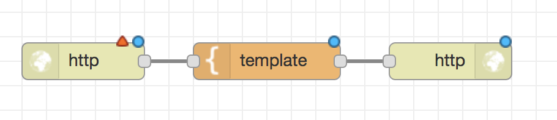
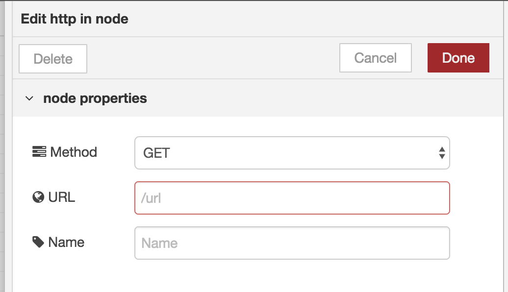
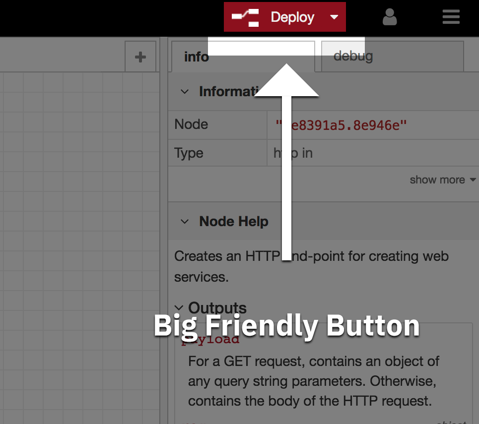
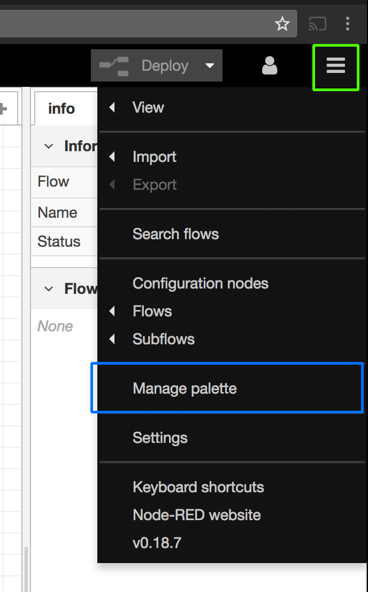

# Node-RED and Watson APIs 101

## Overview

By following this workshop, you will learn:

1. The basic application of flow-based programming (with Node-RED)
2. How to create a simple web server and pass messages between client and server
3. How to use artificial intelligence APIs (IBM Watson Services) with your applications and data.

## Prerequistes

To follow this workshop, you will need:

1. [Node-RED](https://nodered.org/docs/getting-started/installation) installed on your system (or a Node-RED instance hosted on IBM Cloud)
2. An IBM Cloud account. _[Sign up here](https://ibm.biz/BdZUdm)_

If you do not wish to create an IBM Cloud account, you will be able to follow the first half of this tutorial by running Node-RED locally on your system, but you won't be able to complete the AI API section of the tutorial.

## Getting Started

### Creating a Node-RED instance in IBM Cloud
_**NB:** If you have Node-RED installed locally, or already running on a server/in IBM Cloud, you can skip the following steps_

1. Log in to your IBM Cloud Account
2. Go to the [IBM Cloud Catalog](https://catalog.bluemix.net)
3. Search for `Node-RED starter` and click the option to start creating a Node-RED instance
4. In the `App name:` field, enter a uniue name for your Node-RED instance. Remember, the name will be used in part to form the URL that you'll use to access your Node-RED instance, make sure to take note of it _or_ make it easily memorable
5. Once you've entered your unique name, click "Create" in the bottom right of the screen.
6. The Node-RED starter instance will now be created an spun up. Once the process is complete the status of the application will change from "Starting" to "Running". When this happens, click the "Visit App URL" link to go to your Node RED dashboard.
7. You'll now be run through a quick 4 step initial setup process. 
    1. When prompted, do create a username and password for your Node-RED instance, this server will be publically accessible on the internet, and we don't want strangers digging around our lovingly crafted flows.
    2. Once you've entered a username and password, just click next until the process completes and you're taken to your Node-RED instance.
8. Click the "Go to your Node-RED flow editor" button to be taken to where we'll start creating our programs.

## Workshop

### Creating a server with the HTTP Node

At it's core, Node-RED is an interface that's running on an HTTP enabled server, this means we can create HTTP endpoints - and Web applications with very little effort 🎉

1. In the nodes panel on the left-hand side of the Node-RED UI, search for the `http` node with one output and drag it onto the canvas.
2. Back in the node panel, search for the `template` node and drag it onto the canvas - then connect the http node's output to the template nodes input.
3. Search for one final node, the `http response` node, which is similar to _ but distinct from_ the http node we created in step 1. This node will only have one input. Drag it onto the canvas and then connect the `template` output node to the `http response`'s input node.
4. You should now have a flow that looks like the following:



Double click the first `http` node to open up the nodes configuration panel. It looks like this:



5. Click in the `URL` field and type in `/foo`. Then click "Done"
6. We've now configured everything we need to display and empty HTML page on the `/foo` route of our Node-RED instance. All we have to do to make our changes take effect is deploy them, and we can do that by hitting the big red friendly "Deploy" button in the top-right of our UI.



7. Once you've done that, we've now created a brand new endpoint to host our web app on 🎊 The page we've just created will exist relative to the URL of your Node-RED instance... 
    - So, if you're running Node-RED locally, the adress of your Node-RED instance ought to be `http://localhost:1880`, which means that the `/foo` route we created can be accessed at `http://localhost:1880/foo`. 
    - If you're running your Node-RED instance on the IBM Cloud, then you'll be able to access the endpoint by removing everything after `mybluemix.net/` in your URL, and replacing it with `/foo` like `https://my-node-red-instance.mybluemix.net/foo`

8. If you visit your URL, you'll be presented with an empty page - **don't panic!** - that's what we're expecting to see!. Head back to your Node-RED UI and then double click on the `template` node to open the configuration panel.

9. Select and delete the `This is the payload: {{payload}} !` text from the config panel and replace it with `<h1>Hello, world!</h1>`. Then click 'Done', and 'Deploy', and then reload the previously blank page. You should now see Hello, World! in big letters.

### Installing and managing Nodes with the Palette

Node-RED has an entire ecosystem of open-source, 3rd party nodes that developers can use to enhance the functionality of their Node-RED instance. If there's a service you want to access, or a filetype you want to work with then there's probably a node for that!

In the next part of this workshop, we're going to install some nodes that make it possible for us to access the webcam and microphone in our web app and send the picture to a new Node-RED endpoint for storage.

1. Head to your Node-RED dashboard and click the hamburger menu at the top-right of the interface (highlighted in green in the below image) and then click the "Manage Palette" button (highlighted in blue in the below image).



2. This will open the node palette. Here, we can install, update, disable, and delete the nodes in our Node-RED instance. On this occassion, we're going to install some new nodes to use with our application. Click on the "install" tab of the configuration panel and then search for `web-components`. 

3. A list will be populated with the available components that we can install. Work through the list until you find the nodes named `node-red-contrib-web-components` and then click "install" in the bottom right of the list item. 
    - If a prompt appears warning that you may need to restart Node-RED, pay it no mind, just click "Install", everything should be fine.

4. We've now installed some new nodes in our Node-RED instance 🎉 In this case, we've installed some nodes that make it easier to use a webcam in our web apps with our Node-RED instance. First up, we need to update the HTML page that we created in the first part of this tutorial with some extra bits and bobs. Double-click on the `template` node and copy/past the following code into the text field.

```HTML
<!DOCTYPE html>
<html>
    <head>
        <title>Node-RED AI Photobooth</title>
        <script src="https://rawgit.com/webcomponents/webcomponentsjs/master/bundles/webcomponents-sd-ce.js"></script>
        <script src="/web-components/camera"></script>
        <meta name="viewport" content="initial-scale=1.0, user-scalable=yes" />
    </head>
    <body>
        
        <node-red-camera data-nr-name="photobooth-camera" data-nr-type="still"></node-red-camera>
        
    </body>
</html>
```

5. Click 'Done' and then 'Deploy'. If you reload the `/foo` web page, you'll see we now have a box telling us that we can "Click to use camera". Do so, and then when prompted click "Accept" to allow your web app to use the camera. We can now take pictures - Smile!

6. So, now we can take pictures with our web app in Node-RED, but we haven't set up a place for those pictures to go. Right now, the pixels capture by your webcam are just flying of into cybernetic oblivion. That's not a fun fate for anything, so let's put that data to use. Go back to your Node-RED flow editor and search for a new node called `component-camera` and drag it onto your flow.

7. Double-click the `component-camera` node you just dragged onto the canvas and enter `photobooth-camera` as the value for the "Connection ID" text field, and then click 'Done'. If you look at the HTML that we copied into our `template` node, you'll see that the `<node-red-camera>` node has an attribute `data-nr-name` and it's value is `photobooth-camera`. This value is used to link the `<node-red-camera>` node in our web app the the `component-camera` node in our Node-RED backend. Now, whenever we take a picture in our web app, it will be send to the `component-camera` node with the same name in our Node-RED flow. Once there, we can do a bunch of things with it!

8. Search for and drag a `debug` node onto the canvas and connect it to your `component-camera` node and then click "Deploy". Before heading back to the `/foo` route, at the top right of your Node-RED dashboard, click the 'debug' tab. This will allow us to see when the `debug` node has receieved an image from the `component-camera` node that we created. 

9. Head back to the web app at `/foo` and reload the page. Take a photo!

10. Go back to your Node-RED dashboard and look at the debug tab. You should see something like `[ 137, 80, 78, 71, 13, 10, 26, 10, 0, 0 … ]` logged out. This means that your Node-RED instance successfully received an image from your web app! Now we're ready to do some clever things 

### Sprinkling our Web Apps with a little AI magic✨